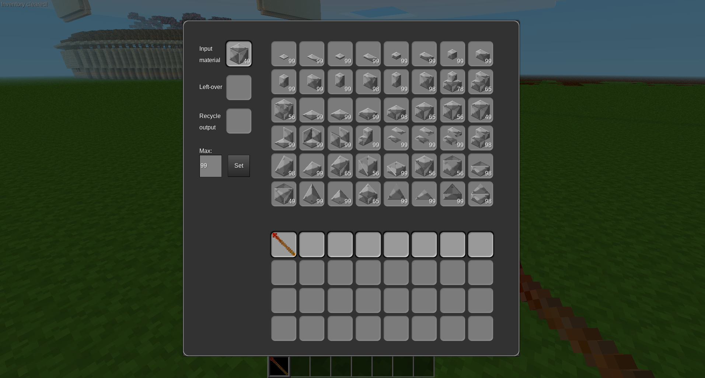

invsaw

A mod for [minetest](http://www.minetest.net)

# overview

This mod adds a button in unified_inventory that opens a formspec that works exactly like the moreblocks circular saw. It requires that either the server is in creative mode, you have the "creative" priv, or you have one or more circular saws (moreblocks:circular_saw) in your inventory.

Contains large amounts of code based on Calinou's moreblocks mod, and a texture based on some textures from the same mod.

# License

* Code `zlib`
* Textures `CC BY-SA 3.0 Unported`
